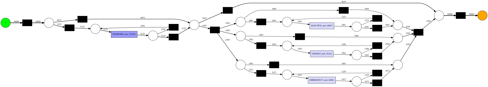
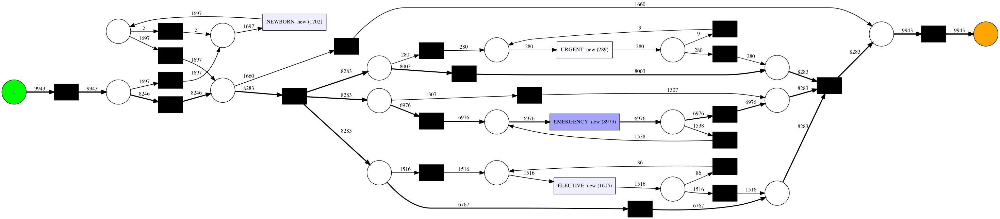
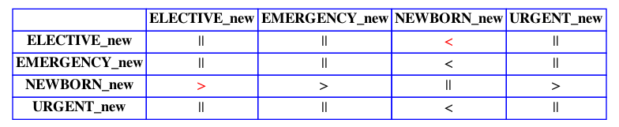

# Patient Sythetic Data Generation

# Team members

Junjie Cai    
Li Gan    
Wenlong Li   

# Description of the problem

There is a growing demand for the uptake of modern artificial intelligence technologies within healthcare systems. Many of these technologies exploit historical patient health data to build powerful predictive models that can be used to improve diagnosis and understanding of disease. [1] However, obtaining realistic patient data to support these evaluations has many challenges, including the risk of re-identifying anonymized patients as well as the costs associated with connecting test systems with production ready clinical databases.[2]   

Synthetic data can be used to protect the privacy and confidentiality of a set of data. Real data contains personal/private/confidential information that a programmer, software creator or research project may not want to be disclosed. Synthetic data holds no personal information and cannot be traced back to any individual; therefore, the use of synthetic data reduces confidentiality and privacy issues.[3]    

# A brief survey

## Synthetic data generation methods

**Drawing numbers from a distribution**:  
This method works by observing real statistical distributions and reproducing fake data. This can also include the creation of generative models.  

**Agent-based modeling**: To achieve synthetic data in this method, a model is created that explains an observed behavior, and then reproduces random data using the same model. It emphasizes understanding the effects of interactions between agents on a system as a whole.  

**Deep learning models**: Variational autoencoder and generative adversarial network (GAN) models are synthetic data generation techniques that improve data utility by feeding models with more data.   

### Challenges of Synthetic Data **Outliers may be missing**:

Synthetic data can only mimic the real-world data, it is not an exact replica of it. Therefore, synthetic data may not cover some outliers that original data has. However, sometimes outliers in the data can be important.  

**Quality of the model depends on the data source**:   
Quality of synthetic data is highly correlated with the quality of the input data and the data generation model. Synthetic data may reflect the biases in source data  

**Synthetic data generation requires time and effort**: Though easier to create than actual data, synthetic data is also not free.  

**Output control is necessary**:   
Especially in complex datasets, the best way to ensure the output is accurate is by comparing synthetic data with authentic data or human-annotated data. this is because there could be inconsistencies in synthetic data when trying to replicate complexities within original datasets  

**Characteristics Consistency**:  
Difficult to keep track of all the necessary characteristics required to replicate data   

# Preliminary plan

## Clinical Data Model

Data for patients can be divived into two primary categories.  

* Static patient data which have 1 to 1 relationships with patients  
* Data for clinical events happend in hospital which have 1 to many relationships with patients and time ordered  

### Static patient data

* All 1 to 1 static patient data can br combined into one tabular formed dataset. We can learning a model from it with GAN and generate new records keeping joint distribution from the original data.
* The one-dimensional data generation confrontation network of GAN is realized through Keras. According to the given training data, by learning the distribution model of the training data, a large amount of data of the same distribution can be generated,The customs clearance GAN network generates float type data, which needs to be changed according to the original data type. Part of the float type data is converted to int type, and the training data and the generated data are consistent.  
* The similarity between the generated data and the training data can be evaluated through js divergence. The value is between 0 and 1, and the exact same calculation result is 0. There are int type data and float type data in the training data.  
* For the generation of category data, data pre-processing and post-processing are required. For example, A, B, and C need to be converted into 1, 2, and 3 first, and then trained with GAN to convert the generated data into A, B and C according to Mapping relations.

### Clinical events data

Clinical events data can be seperated into two components:  

#### Event logs

##### Process Discovery

Event logs describing the clinical events transition and time interval. We can train process mining[4] models to capture the characteris from original data.  

Process Discovery algorithms want to find a suitable process model that describes the order of events/activities that are executed during a process execution.

In the following, we made up an overview to visualize the advantages and disadvantages of the mining algorithms.

| Alpha                                               | Alpha+                                              | Heuristic                        | Inductive                              |
| --------------------------------------------------- | --------------------------------------------------- | -------------------------------- | -------------------------------------- |
| Cannot handle loops of length one and length two    | Can handle loops of length one and length two       | Takes frequency into account     | Can handle invisible tasks             |
| Invisible and duplicated tasks cannot be discovered | Invisible and duplicated tasks cannot be discovered | Detects short loops              | **Model is sound**                     |
| Discovered model might not be sound                 | Discovered model might not be sound                 | Does not guarantee a sound model | **Most used process mining algorithm** |

There may be multiple cycles in clinical events. In order to ensure the reliability of the algorithm, we choose to the **inductive** miner algorithm.

##### Process models structures

###### Petri nets：

Process models modeled using Petri nets have a well-defined semantic: a process execution starts from the places included in the initial marking and finishes at the places included in the final marking. 

Petri nets with frequency 

###### Directly-Follows Graphs：

Directly-Follows Graphs, are introduced. Directly-Follows graphs are graphs where the nodes represent the events/activities in the log and directed edges are present between nodes if there is at least a trace in the log where the source event/activity is followed by the target event/activity. On top of these directed edges, it is easy to represent metrics like frequency and performance

​										frequency DFG

###### Process tree:

A process tree is a process model and a compact abstract representation of a block-structured workflow net: a rooted tree in which leaf nodes are labeled with activities, and all other nodes are labeled with operators. All nodes have a unique identifier to distinguish leaves having the same label. Furthermore, process trees are sound by definition, therefore, the correctness of the process model is guaranteed.

#### 	

##### Playout of a Petri Net

A playout of a Petri net takes as input a Petri net along with an initial marking, and returns a list of process executions that are allowed from the process model.

Playout of a Petri Net event log of Petri Net with frequency

##### Monte Carlo Simulation

A time-related simulation permits to know how probable is that a process execution is terminated after a given amount of time. This leads to a better estimation of Service Level Agreements, or a better identification of the process instances that are most likely to have an high throughput time. All this starts from a performance DFG.

Monte Carlo Simulation event log of Petri Net with frequency

#### Extensive Playout of a Process Tree

An extensive playout operation permits to obtain entire path of the process model. Doing an extensive playout operation on a Petri net can be incredibly expensive. Process trees, with their bottom-up structure, permit to obtain the entire path of an event log in a much easier way

#### Process evaluation

**process discovery: The importance of fitness, precision, generalization and simplicity**

| Method                 | Precision | Fitness | Generalization | Simplicity |
| ---------------------- | --------- | ------- | -------------- | ---------- |
| Playout of a Petri Net | 0.9497    | 1.0     | 0.9831         | 0.6875     |
| Monte Carlo Simulation | 0.9831    | 1.0     | 0.9356         | 0.6875     |

**Replay evaluation**

#### Footprints

| Method                 | Precision | Fitness |
| ---------------------- | --------- | ------- |
| Playout of a Petri Net | 1.0       | 1.0     |
| Monte Carlo Simulation | 1.0       | 0.99995 |

Footprints function evaluation

#### Event properties

Clincal events have properties which is specific to each kind of event, such as test value for laboratory test event.  
Given event type, event properties can be combined into one tabular data table and GAN can be used to capture its propery and generate syntetic data later.  

# Intermediate Results

## Finished part

* Complete the basic system framework.  
* Collect and simulate data.  
* Use Keras to implement a one-dimensional data adversarial generative model.  
* Use ProM Tools to do process mining analysis and Pm4py to achieve process mining.  
* Integrate anti-generation model and process mining to achieve complete data generator  

## Later work

* Complete the report and describe the technical details.  
* Evaluate the existing model and adjust the optimized model.  

## Division of work

* Junjie Cai: basic system framework and collect data.  
* Li Gan: Research process mining algorithm and code.  
* Wenlong Li: Research GAN algorithm and code.  

### Plan Framework

  

# Reference

1. Tucker, A., Wang, Z., Rotalinti, Y. and Myles, P., 2020. Generating high-fidelity synthetic patient data for assessing machine learning healthcare software. NPJ digital medicine, 3(1), pp.1-13.  
2. Pollack, A.H., Simon, T.D., Snyder, J. and Pratt, W., 2019. Creating synthetic patient data to support the design and evaluation of novel health information technology. Journal of biomedical informatics, 95, p.103201.  
3. https://en.wikipedia.org/wiki/Synthetic_data  
4. https://en.wikipedia.org/wiki/Process_mining